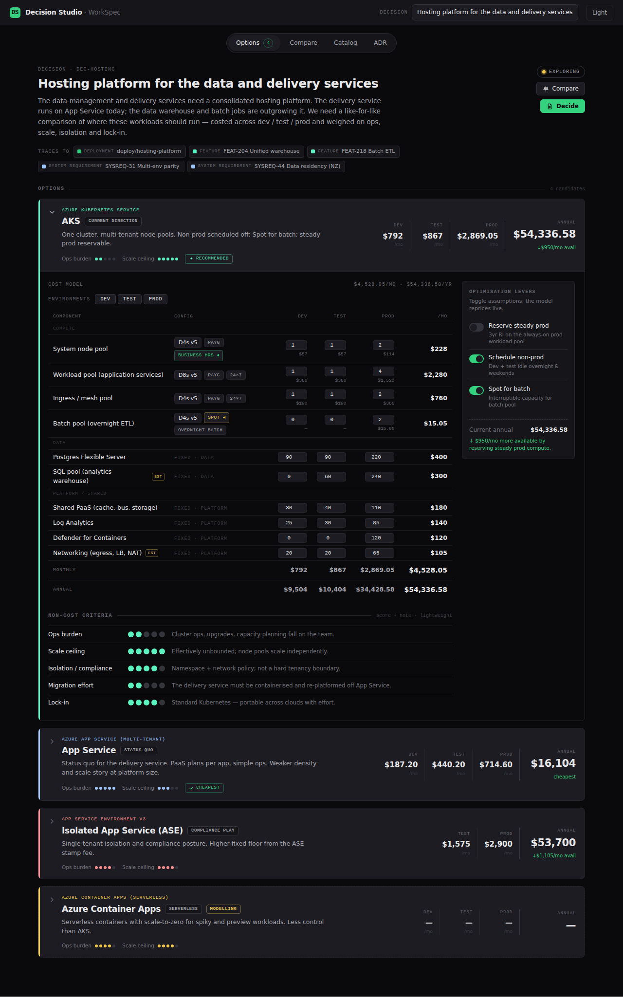

> [!IMPORTANT]
> **Superseded by [workspec-studio](https://github.com/FieldstateNZ/workspec-studio).**
> The Decisions packages in this monorepo were imported into `workspec-studio` with
> full git history and are actively developed there. This repository is kept for
> reference and is no longer maintained.

# WorkSpec Decision Studio

> **Costed architecture decisions as reviewable YAML artifacts. Free, standalone, git-native.**

"Which platform should we run on?" usually ends up as a slide deck and a lost Slack thread.
WorkSpec Decision Studio turns it into a **reviewable artifact**: options costed across
dev / test / prod, weighed on the criteria that matter, and recorded as an ADR — all as plain
`*.decision.yaml` / `*.catalog.yaml` files that live beside your code and version with git.

**No database.** The files in your working tree are the single source of truth; the app never
owns state your repo doesn't. Toggle an optimisation lever and every number reprices live;
decide, and the outcome is written back to the YAML for your next PR.



## 60-second quickstart

In any repo that has a `*.decision.yaml` (grab the [`examples/`](./examples) to try it):

```bash
npx @workspec/decision-studio        # opens http://localhost:4173 over the working tree
```

That's it — no install, no config, no database. Pick a decision, toggle a lever, watch the cost
change, and hit **Decide** to record the outcome back into the YAML.

Prefer the terminal, or wiring into CI?

```bash
npx @workspec/decision-studio validate    --dir .        # exits non-zero on any invalid artifact
npx @workspec/decision-studio render-adr  --dir . > adr.md   # deterministic Markdown ADR
```

## Two worked examples

| Example                                                                                  | What it shows                                                                                              |
| ---------------------------------------------------------------------------------------- | ---------------------------------------------------------------------------------------------------------- |
| [`examples/hosting-platform`](./examples/hosting-platform)                               | Four hosting options (AKS / App Service / ASE / Container Apps) across dev/test/prod — the golden fixture. |
| [`examples/postgres-managed-vs-self-hosted`](./examples/postgres-managed-vs-self-hosted) | Managed PaaS vs HA vs self-hosted on k8s — a _decided_ record where **cheapest ≠ chosen**.                 |

## Schema + editor IntelliSense

Every artifact starts with a `yaml-language-server` directive that binds it to a JSON Schema, so
a good editor gives you completion, hover docs, and inline validation as you type:

```yaml
# yaml-language-server: $schema=https://schema.workspec.io/v1alpha1/decision.schema.json
apiVersion: workspec.io/v1alpha1
kind: Decision
# …
```

In **VS Code**, install the [YAML extension](https://marketplace.visualstudio.com/items?itemName=redhat.vscode-yaml)
(`redhat.vscode-yaml`) — it reads the directive and lights up. The tooling writes the header for
you on every save.

> **Schema hosting.** `https://schema.workspec.io/v1alpha1/…` is the canonical URL, served from
> [`FieldstateNZ/workspec-schemas`](https://github.com/FieldstateNZ/workspec-schemas). This repo's
> own GitHub Pages now serves the [product site](./apps/site) at `decision-studio.workspec.io`
> ([`pages.yml`](./.github/workflows/pages.yml)). You can also point `$schema` at the committed
> files under [`json-schema/`](./json-schema) directly.

## Use it in CI

Fail the build if a decision or catalog is malformed:

```yaml
# .github/workflows/decisions.yml
name: Validate decisions
on: [push, pull_request]
jobs:
  validate:
    runs-on: ubuntu-latest
    steps:
      - uses: actions/checkout@v4
      - uses: actions/setup-node@v4
        with:
          node-version: 20
      - run: npx --yes @workspec/decision-studio validate --dir .
```

`validate` prints `file:line:col: message` diagnostics and exits non-zero on any error, so your
costed decisions stay valid the same way your code does.

## Open core

Decision Studio is the free, standalone half of WorkSpec. The **artifact schema is shared** with
WorkSpec Enterprise, so the same `*.decision.yaml` files come alive inside the enterprise graph:
the `links` block that renders as inert labels standalone (deployments, features, system
requirements) **comes alive in WorkSpec Enterprise**, resolving to the real objects. The identical
UI mounts inside Enterprise's shell as a module-federation remote — no forks, one source. See
[`docs/workspec-tech-spec-v0.1.md`](./docs/workspec-tech-spec-v0.1.md).

## Packages

| Package                     | Path              | Role                                                                      |
| --------------------------- | ----------------- | ------------------------------------------------------------------------- |
| `@workspec/decision-schema` | `packages/schema` | Zod source of truth → TS types, runtime validation, JSON Schema           |
| `@workspec/decision-engine` | `packages/engine` | Pure, normative cost engine (no IO, no DOM)                               |
| `@workspec/decision-ui`     | `packages/ui`     | Host-agnostic React views (standalone + module-federation remote)         |
| `@workspec/decision-studio` | `packages/studio` | Standalone CLI + localhost host shell (`validate`, `render-adr`, `serve`) |

Dependency direction is enforced by package boundaries: **schema ← engine ← ui ← studio**.

## Docs

- [Decision schema spec (v0.1)](./docs/workspec-decision-schema-v0.1.md) — the artifact format, field by field.
- [Technical design (v0.1)](./docs/workspec-tech-spec-v0.1.md) — package layout, the repository-port seam, the normative engine contract, and the open-core model.
- [Architecture decisions (D1–D6)](./docs/decisions) — the project's own decisions, several dogfooded as `*.decision.yaml`.
- [Releasing](./RELEASING.md) — how the packages publish.

## Develop

```bash
pnpm install
pnpm -r build
pnpm -r test
pnpm --filter @workspec/decision-studio dev   # serve the hosting-platform example at http://localhost:4173
```

## License

[Apache-2.0](./LICENSE) © 2026 Fieldstate
